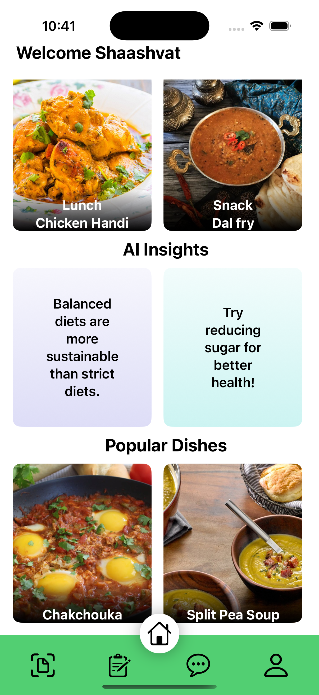
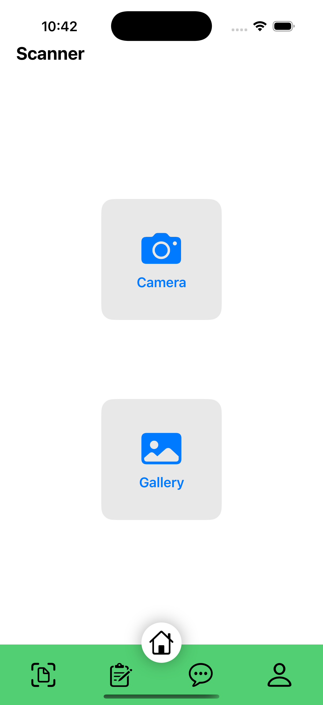
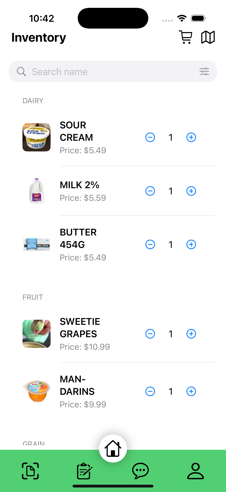
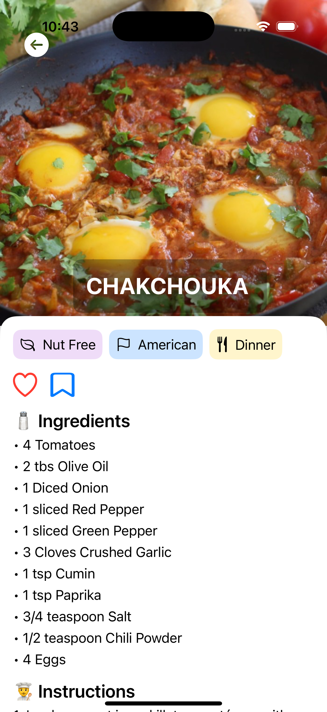
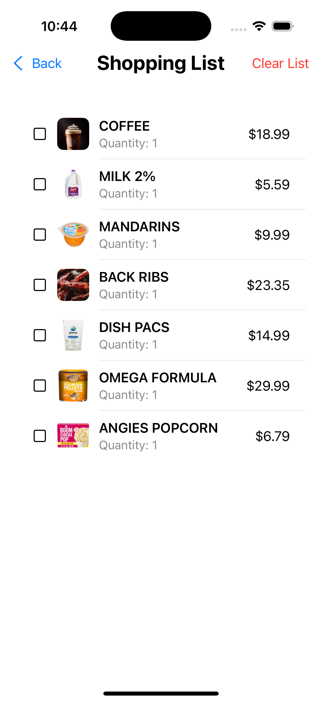
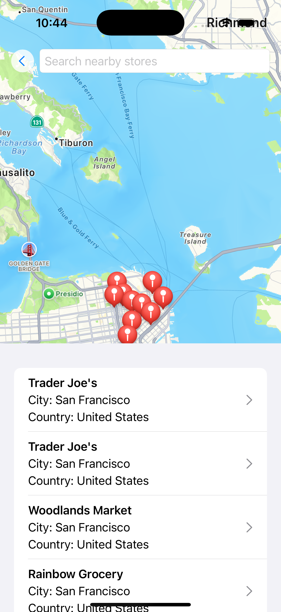
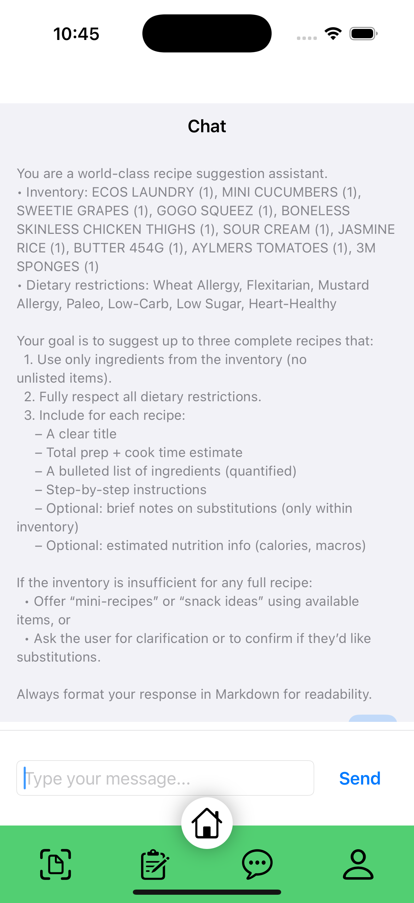
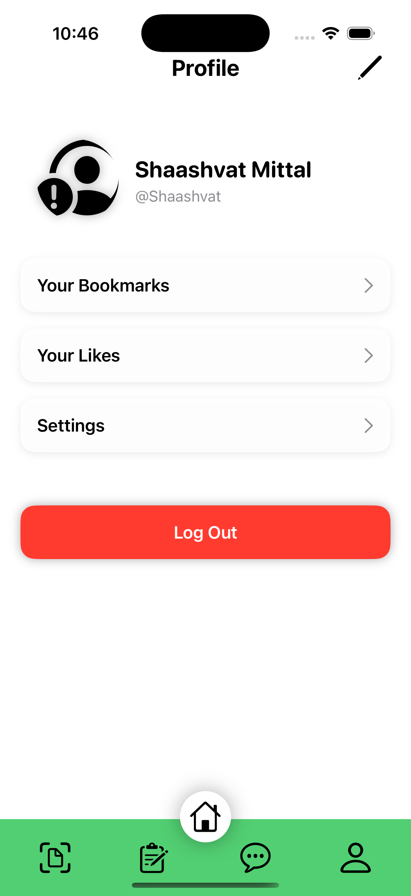

# Zesto 🍎

**A Smart Grocery Management & Recipe Discovery iOS App**

Zesto is a sophisticated iOS application that transforms the way users approach grocery shopping and culinary planning. By leveraging cutting-edge artificial intelligence, computer vision, and machine learning technologies, Zesto delivers an intelligent ecosystem that streamlines inventory management, automates receipt processing, and provides personalized culinary insights. The app seamlessly integrates advanced OCR capabilities with AI-powered analysis to create a comprehensive solution for modern households seeking efficiency, sustainability, and culinary inspiration in their daily food management routines.

## ✨ Features

### 🛒 **Smart Receipt Scanning**
- **AI-Powered OCR**: Advanced text recognition using Apple's Vision framework
- **Receipt Parsing**: OpenAI GPT-3.5 integration for intelligent item extraction
- **Automatic Categorization**: Smart classification into 12 food categories
- **Camera & Gallery Support**: Scan receipts or upload existing images

### 📱 **Inventory Management**
- **Real-time Tracking**: Monitor food items, quantities, and expiration dates
- **Smart Categorization**: Organize items by type (Fruit, Vegetable, Dairy, Meat, etc.)
- **Search & Filter**: Find items by name, price, quantity, or category
- **SwiftData Integration**: Persistent local storage with modern iOS data management

### 🍳 **Recipe Discovery**
- **Personalized Recommendations**: AI-driven recipe suggestions based on inventory
- **Dietary Preferences**: Support for vegetarian, vegan, gluten-free, and 20+ dietary restrictions
- **Recipe Details**: Complete ingredients, instructions, and nutritional information
- **Meal Planning**: Discover recipes that use ingredients you already have

### 🗺️ **Grocery Store Locator**
- **Location Services**: Find nearby grocery stores using MapKit
- **Store Information**: View store details, ratings, and directions
- **Search Functionality**: Search for specific stores or chains
- **Real-time Navigation**: Get directions to your preferred stores

### 💬 **AI Shopping Assistant**
- **Chat Interface**: Interactive AI chat for grocery-related questions
- **Inventory Insights**: Get recommendations based on your current food items
- **Shopping Lists**: AI-powered shopping list generation
- **Contextual Help**: Personalized assistance for meal planning and shopping

### 👤 **User Management**
- **Firebase Authentication**: Secure user login and registration
- **Profile Customization**: Set dietary preferences, allergies, and restrictions
- **Data Sync**: Cloud-based data synchronization across devices
- **Privacy-First**: Local data storage with optional cloud backup

## 🏗️ Architecture

### **Frontend**
- **SwiftUI**: Modern declarative UI framework
- **MVVM Pattern**: Clean separation of concerns with ViewModels
- **Environment Objects**: Efficient state management across views
- **Navigation Stack**: Intuitive app navigation with deep linking

### **Backend & Services**
- **Firebase**: Authentication, Firestore database, and cloud storage
- **OpenAI API**: GPT-3.5 integration for intelligent text processing
- **Apple Vision Framework**: Advanced image processing and OCR
- **SwiftData**: Modern iOS data persistence framework
- **MapKit**: Location services and mapping functionality

### **Data Models**
- **InventoryItem**: Food item management with categories and pricing
- **RecipeModel**: Recipe data structure with ingredients and instructions
- **ShoppingListItem**: Shopping list management with checkboxes
- **UserModel**: User profile and dietary preferences

## 🚀 Getting Started

### **Prerequisites**
- iOS 17.0+
- Xcode 15.0+
- Swift 5.9+
- Apple Developer Account (for device testing)

### **Installation**

1. **Clone the repository**
   ```bash
   git clone https://github.com/yourusername/Zesto.git
   cd Zesto
   ```

2. **Install dependencies**
   - Open `Zesto.xcodeproj` in Xcode
   - Ensure all required frameworks are linked

3. **Configure Firebase**
   - Add your `GoogleService-Info.plist` to the project
   - Configure Firebase in your Firebase console

4. **Set up OpenAI API**
   - Create a `secrets.plist` file with your OpenAI API key
   - Add it to the project bundle

5. **Build and run**
   - Select your target device or simulator
   - Press `Cmd + R` to build and run

### **Required API Keys**
- **Firebase**: For authentication and cloud services
- **OpenAI**: For intelligent receipt parsing and chat assistance
- **Google Maps**: For location services (included in Firebase)

## 📱 Screenshots

### **App Interface Overview**

#### **Main Features**
<div align="center">
   &nbsp;
  
  
  
</div>

#### **Additional Features**
<div align="center">
  
  
  
  
</div>

*From left to right: Home Dashboard, Receipt Scanning, Inventory Management, Recipe Discovery, Shopping List, Store Locator, AI Chat Assistant, and User Profile*

## 🔧 Configuration

### **Firebase Setup**
```swift
// Configure Firebase in ZestoApp.swift
init() {
    FirebaseApp.configure()
}
```

### **OpenAI Configuration**
```swift
// Add your API key to secrets.plist
// The app will automatically load it for receipt processing
```

### **Location Permissions**
```xml
<!-- Add to Info.plist -->
<key>NSLocationWhenInUseUsageDescription</key>
<string>This app uses your location to show nearby grocery stores.</string>
```

## 🎯 Use Cases

### **For Home Cooks**
- Track kitchen inventory and reduce food waste
- Discover new recipes using available ingredients
- Plan shopping trips efficiently

### **For Health-Conscious Users**
- Monitor dietary restrictions and allergies
- Get personalized recipe recommendations
- Track nutritional intake and meal planning

### **For Busy Professionals**
- Quick receipt scanning and expense tracking
- Automated shopping list generation
- Time-saving meal planning

## 🔒 Privacy & Security

- **Local Data Storage**: Primary data stored locally using SwiftData
- **Secure Authentication**: Firebase Auth with industry-standard security
- **API Key Protection**: Sensitive keys stored in secure configuration files
- **User Consent**: Clear permission requests for camera and location access

## 🤝 Contributing

We welcome contributions! Create a pull request to submit your changes.

### **Development Setup**
1. Fork the repository
2. Create a feature branch
3. Make your changes
4. Add tests if applicable
5. Submit a pull request

## 📄 License

This project is licensed under the MIT License - see the [LICENSE](LICENSE) file for details.

## 🙏 Acknowledgments

- **Apple**: For Vision framework and SwiftUI
- **OpenAI**: For GPT-3.5 API integration
- **Firebase**: For backend services and authentication
- **The Meal DB**: For recipe data and inspiration

---

**Built with ❤️ using SwiftUI and modern iOS technologies**

*Zesto - Making grocery shopping smarter, one receipt at a time.* 
